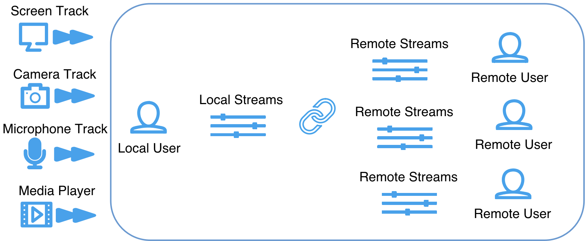

## 概述

相比 Agora RTC SDK，Agora RTE SDK 不再直接根据实际业务流程抽象，而是基于实际业务模块抽象重新建模，这样你可以通过搭积木的方式，快速完成实时互动的业务场景，轻松满足复杂变化的业务需求。RTE SDK 的业务流程如下图所示：

如上图所示，你可以通过 SDK 基于场景、人、流实现实时互动应用。

- 场景：提供了实时互动的场所。
- 人：参与实时互动的本地和远端用户。
- 流：实时互动最基础的媒体流，以及配套的道具，比如本地播放器、本地推流器等。流由轨道组成。

## 特性描述

RTE SDK 具备以下特性：

- 灵活性 - 提供了清晰的业务模块的抽象，提供了场景、人、流以及相关道具的抽象。你可以通过搭积木的方式，快速满足复杂的场景化需求。
- 易用性 - API 提供了完全正交的设计，每一个 API 都有明确的行为描述，易懂，易用。API 本身不再预埋业务逻辑，避免和客户业务冲突。
- 功能强大 - 提供了全新的产品组合，提供了更加丰富功能，比如多路音视频源、本地合图、本地直推 CDN、本地播放器等组件。通过不断丰富的内部组件，让业务开发更加容易，同时在性能、包体积上也具备优势。
- 扩展性强- 支持云市场。提供了一套完善的音视频插件系统，你可以建设完整的实时互动生态。可以同时服务插件开发者与 App 开发者：
  - 为插件开发者提供了云市场自服务的入口，提供了完整的、更容易创造商业价值的实时互动平台。
  - 为 App 开发者提供全场景的实时互动解决方案，并提供了更多丰富的插件选择和极其易用的 API。