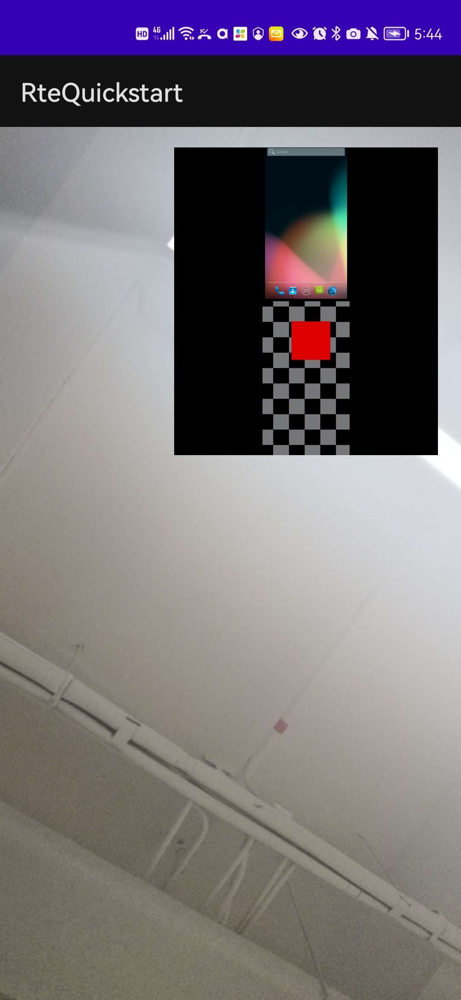

# 五分钟实现摄像头流和屏幕共享流的同时发送


本文介绍如何通过极简代码快速实现摄像头流和屏幕共享流的同时发送。


## 前提条件

你已经根据 [五分钟构建视频通话应用](start_call_android_rte.md) 搭建了一个基础的视频通话应用。

> 在此教程中，Android 系统需要 Android 5 或更高版本。
> 实测在夜神模拟器/雷电模拟器/ Android Studio 自带模拟器（Android 5）环境下运行正常。

## 实现流程

对你已经搭建的应用做以下变更。

1. 在 `Gradle Scripts/build.gradle(Module: RteQuickstart.app)` 文件中将 minSdk改为 21。这也是实现屏幕录制功能要求的最低 Android 版本。

  ```diff
  - minSdk 16
  + minSdk 21
  ```

2. 在 `Gradle Scripts/build.gradle(Module: RteQuickstart.app)` 文件中添加以下依赖：

  ```diff
  -  implementation 'androidx.appcompat:appcompat:1.2.0'
  +  implementation 'androidx.appcompat:appcompat:1.3.1'
  +  implementation 'androidx.core:core:1.6.0'
    implementation 'com.google.android.material:material:1.3.0'
  -  implementation 'androidx.constraintlayout:constraintlayout:2.0.4'
  +  implementation 'androidx.constraintlayout:constraintlayout:2.1.0'
  ```

3. 在 `/app/Manifests/AndroidManifest.xml` 文件添加如下权限：

  ```xml
  <uses-permission android:name="android.permission.FOREGROUND_SERVICE" />
  ```

4. 添加一个 service，用于运行 media projection 服务。

  在 `/app/Manifests/AndroidManifest.xml` 文件中添加 MediaProjectionForegroundService 服务。

  ```xml
  +      <service
  +      android:name=".MediaProjectionForegroundService"
  +      android:enabled="true"
  +      android:exported="true"
  +      android:foregroundServiceType="mediaProjection"></service>

    <activity
        android:name=".MainActivity"
        android:exported="true">
  ```

  在 `/app/res/drawable` 目录下添加 ic_notification_icon.xml 文件，作为 notification 所需的 icon。

  ```xml
  <?xml version="1.0" encoding="utf-8"?>
  <vector xmlns:android="http://schemas.android.com/apk/res/android"
      android:width="108dp"
      android:height="108dp"
      android:viewportWidth="108"
      android:viewportHeight="108">
      <path
          android:pathData="M24,54A30,30 0 0 0 84,54A30,30 0 0 0 24,54"
          android:strokeWidth="20"
          android:strokeColor="#FFFFFFFF"
          android:fillType="nonZero" />
      <path
          android:pathData="M94,92C68,90 68,20 94,16Z"
          android:fillType="nonZero"
          android:fillColor="#FFFFFFFF" />
  </vector>
  ```

  创建 `/app/java/com.example.rtequickstart/MediaProjectionForegroundService.java` 文件。

  ```java
  package com.example.rtequickstart;

  import android.app.Notification;
  import android.app.NotificationChannel;
  import android.app.NotificationManager;
  import android.app.Service;
  import android.content.Context;
  import android.content.Intent;
  import android.graphics.drawable.Icon;
  import android.os.Build;
  import android.os.IBinder;

  import androidx.annotation.Nullable;
  import androidx.core.app.NotificationCompat;
  import androidx.core.content.ContextCompat;

  import java.util.Random;
  //  targetSdkVersion 设置为 28 时,想要使用前台服务的应用必须首先请求 FOREGROUND_SERVICE 权限。
  //  这是普通权限，因此，系统会自动为请求权限的应用授予此权限。在未获得此权限的情况下启动前台服务将会引发 SecurityException。
  //  参考：https://developer.android.com/about/versions/pie/android-9.0-migration#tya
  public class MediaProjectionForegroundService extends Service {

      NotificationManager notificationManager;
      Icon icon;

      @Nullable
      @Override
      public IBinder onBind(Intent intent) {
          return null;
      }

      @Override
      public void onCreate() {
          super.onCreate();
          createNotificationChannel();
      }

      @Override
      public int onStartCommand(Intent intent, int flags, int startId) {
          return START_NOT_STICKY;
      }

      @Override
      public void onDestroy() {
          super.onDestroy();
          stopForeground(true);
      }

      private void createNotificationChannel() {

          String channelId = "screen_share_id";

          // 从 API 26 开始必须有 NotificationChannel 才能发送 Notification
          // 参考：https://developer.android.com/training/notify-user/channels
          if(Build.VERSION.SDK_INT >= Build.VERSION_CODES.O) {
              int importance = NotificationManager.IMPORTANCE_HIGH;
              NotificationChannel channel = new NotificationChannel(channelId, MediaProjectionForegroundService.class.getSimpleName(), importance);
              channel.setDescription("The app is about to record the screen");
              notificationManager = (NotificationManager)
                      getSystemService(Context.NOTIFICATION_SERVICE);
              notificationManager.createNotificationChannel(channel);
          }


          // 创建 notification 并设置 notification channel
          Notification notification = new NotificationCompat.Builder(this, channelId)
                  .setContentTitle("Screen Recording")
                  .setContentText("Recording the screen")
                  // 你必须设置一个 icon
                  .setSmallIcon(R.drawable.ic_notification_icon)
                  .setWhen(System.currentTimeMillis())
                  .build();

          startForeground(new Random().nextInt(1024) + 1024, notification);
      }
  }
  ```

5. 对 `/app/java/com.example.rtequickstart/MainActivity.java` 文件做如下修改。

```diff
@@ -1,15 +1,23 @@
 package com.example.rtequickstart;

+import androidx.annotation.RequiresApi;
 import androidx.core.app.ActivityCompat;
 import androidx.core.content.ContextCompat;
+import androidx.activity.result.ActivityResultLauncher;
+import androidx.activity.result.contract.ActivityResultContracts;

 import android.Manifest;
+import android.content.Context;
+import android.content.Intent;
 import android.content.pm.PackageManager;
+import android.os.Build;
 import android.util.TypedValue;
 import android.view.SurfaceView;

 import android.view.View;
 import android.view.ViewGroup;
 import android.widget.FrameLayout;
+import android.media.projection.MediaProjectionManager;

 import java.util.List;
 import java.util.Random;
@@ -33,7 +41,9 @@
 import io.agora.rte.media.stream.AgoraRteMediaStreamInfo;
 import io.agora.rte.media.track.AgoraRteCameraVideoTrack;
 import io.agora.rte.media.track.AgoraRteMicrophoneAudioTrack;
+import io.agora.rte.media.track.AgoraRteScreenVideoTrack;
 import io.agora.rte.media.video.AgoraRteVideoCanvas;
+import io.agora.rte.media.video.AgoraRteVideoEncoderConfiguration;
 import io.agora.rte.media.video.AgoraRteVideoSubscribeOptions;

 import io.agora.rte.scene.AgoraRteConnectionChangedReason;
@@ -53,13 +63,17 @@
     // 你的 Agora scene name
     private String sceneId = "testScene";
     // 自动生成随机 user ID
-    private String userId = String.valueOf(new Random().nextInt(1024));
+    private String userId = "user_" + String.valueOf(new Random().nextInt(1024));

     // 你的 Token。在本示例中设为 ""
     private String token = "";

     // 自动生成随机流 ID
-    private String streamId = String.valueOf(new Random().nextInt(1024));
+    private String streamId = "stream_" + String.valueOf(new Random().nextInt(1024));
+    private String screenStreamId = "screen_stream_" + String.valueOf(new Random().nextInt(1024));
+
+    private Intent mediaProjectionIntent;
+    private ActivityResultLauncher<Intent> activityResultLauncher;

     // Scene 对象
     public AgoraRteScene mScene;
@@ -69,11 +83,22 @@
     public AgoraRteCameraVideoTrack mLocalVideoTrack;
     // 麦克风音频轨道对象
     public AgoraRteMicrophoneAudioTrack mLocalAudioTrack;
+    // 屏幕录制视频轨道对象
+    public AgoraRteScreenVideoTrack mScreenVideoTrack;
     // 加入 scene 选项对象
     public AgoraRteSceneJoinOptions options;

     public AgoraRteMediaFactory mMediaFactory;

+    @RequiresApi(api = Build.VERSION_CODES.LOLLIPOP)
+    private void initScreenActivity() {
+        mediaProjectionIntent = new Intent(this, MediaProjectionForegroundService.class);
+        MediaProjectionManager mgr = (MediaProjectionManager) getSystemService(Context.MEDIA_PROJECTION_SERVICE);
+        Intent intent = mgr.createScreenCaptureIntent();
+        activityResultLauncher.launch(intent);
+    }
+
+
     // 处理设备权限
     private static final int PERMISSION_REQ_ID = 22;

@@ -95,27 +120,36 @@ private boolean checkSelfPermission(String permission, int requestCode) {
     protected void onCreate(Bundle savedInstanceState) {
         super.onCreate(savedInstanceState);
         setContentView(R.layout.activity_main);
+
         // 1. 初始化 SDK
         initAgoraRteSDK();
         // 2. 初始化 AgoraRteSceneEventHandler 对象
         registerEventHandler();
-        // 3. 申请设备权限。权限申请成功后，创建并加入 scene, 监听远端媒体流并发送本地媒体流
+        // 3. 申请设备权限。权限申请成功后：
+        // createAndJoinScene 创建并加入场景, 监听远端媒体流并发送本地媒体流
+        // registerScreenActivity 注册监听器，在 media projection activity 完成时创建并发布屏幕录制视频轨道
         if (checkSelfPermission(REQUESTED_PERMISSIONS[0], PERMISSION_REQ_ID) &&
                 checkSelfPermission(REQUESTED_PERMISSIONS[1], PERMISSION_REQ_ID)) {
             createAndJoinScene(sceneId, userId, token);
+            registerScreenActivity();
         }

-    }
+        // 4. 启动屏幕录制进程
+        initScreenActivity();
+        }

     protected void onDestroy() {
         super.onDestroy();

-        // 3. 离开 scene
+        // 1. 停止屏幕录制
+        this.stopService(mediaProjectionIntent);
+
+        // 2. 离开 scene
         /**
          * 离开 scene。
          */
         mScene.leave();
-        // 4. 销毁 AgoraRteSDK 对象
+        // 3. 销毁 AgoraRteSDK 对象
         /**
          * 销毁 AgoraRteSDK 对象。
          *
@@ -155,7 +189,7 @@ public void createAndJoinScene(String sceneId, String userId, String token) {
          */
         mScene = AgoraRteSDK.createRteScene(sceneId, sceneConfig);

-        // 注册 scene event handler
+        // 注册场景事件监听器
         mScene.registerSceneEventHandler(mAgoraHandler);

         options = new AgoraRteSceneJoinOptions();
@@ -174,6 +208,32 @@ public void createAndJoinScene(String sceneId, String userId, String token) {
         mScene.join(userId, token, options);
     }

+    // 通过 mediaProjection 返回的 activity result 创建并发布屏幕录制视频轨道
+    public void registerScreenActivity(){
+        activityResultLauncher = registerForActivityResult(new ActivityResultContracts.StartActivityForResult(), result -> {
+
+            if (Build.VERSION.SDK_INT >= Build.VERSION_CODES.O) {
+                // this.startForegroundService(mediaProjectionIntent);
+                this.startForegroundService(mediaProjectionIntent);
+
+            } else {
+                this.startService(mediaProjectionIntent);
+            }
+
+            if (result.getResultCode() == RESULT_OK) {
+                if (mScreenVideoTrack == null) {
+                    // 创建屏幕录制视频轨道
+                    mScreenVideoTrack = AgoraRteSDK.getRteMediaFactory().createScreenVideoTrack();
+                }
+                mScene.createOrUpdateRTCStream(screenStreamId, new AgoraRtcStreamOptions());
+                mScreenVideoTrack.startCaptureScreen(result.getData(), new AgoraRteVideoEncoderConfiguration.VideoDimensions());
+
+                // 发布屏幕录制视频轨道
+                mScene.publishLocalVideoTrack(screenStreamId, mScreenVideoTrack);
+            }
+        });
+    }
+
     // 初始化 AgoraRteSceneEventHandler 对象
     public void registerEventHandler(){
         // 创建 AgoraRteSceneEventHandler 对象
@@ -292,6 +352,8 @@ public void onCameraStateChanged(AgoraRteCameraState agoraRteCameraState, AgoraR
                      * <0：方法调用失败。
                      */
                     mScene.publishLocalAudioTrack(streamId, mLocalAudioTrack);
+
+
                 }
             }

@@ -331,6 +393,8 @@ public void onRemoteStreamAdded(List<AgoraRteMediaStreamInfo> streams) {

                 for (AgoraRteMediaStreamInfo info : streams) {

                     /**
                      * 订阅远端视频。
                      *
@@ -346,8 +410,8 @@ public void onRemoteStreamAdded(List<AgoraRteMediaStreamInfo> streams) {
                     mScene.subscribeRemoteAudio(info.getStreamId());

                     LinearLayout container = findViewById(R.id.remote_video_view_container);
                     SurfaceView view = new SurfaceView (getBaseContext());

                     view.setZOrderMediaOverlay(true);

                     view.setTag(info.getStreamId());
@@ -355,9 +419,10 @@ public void onRemoteStreamAdded(List<AgoraRteMediaStreamInfo> streams) {
                     view.setId(ViewCompat.generateViewId());
                     view.setSaveEnabled(true);

                     ViewGroup.LayoutParams layoutParams = new LinearLayout.LayoutParams(LinearLayout.LayoutParams.MATCH_PARENT, (int) TypedValue.applyDimension(TypedValue.COMPLEX_UNIT_DIP, 120, getResources().getDisplayMetrics()));
                     container.addView(view, -1, layoutParams);
-
                     AgoraRteVideoCanvas canvas = new AgoraRteVideoCanvas(view);
                     /**
                      * public static final int RENDER_MODE_HIDDEN = 1;
@@ -375,7 +440,6 @@ public void onRemoteStreamAdded(List<AgoraRteMediaStreamInfo> streams) {
                      * <0：方法调用失败。
                      */
                     mScene.setRemoteVideoCanvas(info.getStreamId(), canvas);
-
                 }

             }
@@ -391,6 +455,8 @@ public void onRemoteStreamRemoved(List<AgoraRteMediaStreamInfo> streams) {

                 for (AgoraRteMediaStreamInfo info : streams) {

                     LinearLayout container = findViewById(R.id.remote_video_view_container);
                     View view = container.findViewWithTag(info.getStreamId());
                     container.removeView(view);
```

### 编译项目并运行 app

将 Android 设备或模拟器连接到你的电脑，并在 Android Studio 里点击 Run 'app'。项目安装到你的设备或模拟器之后，按照以下步骤运行 app：

- 授予你的 app 麦克风和摄像头权限。
- 授予你的 app 屏幕录制权限。
- 启动 app，你会在本地视图中看到自己。
- 在另一台设备或模拟器上运行 app，你可以看到在远端视图看到对端设备采集的视频，包括摄像头视频和屏幕录制视频。



## 常见问题

### Android gradle sync 太慢怎么办？

在 `/Gradle Scripts/build.gradle(Project: RteQuickstart)` 文件中，添加国内镜像源地址。

以阿里云云效 Maven 镜像为例：

```diff
repositories {

...

+    maven {
+      url 'https://maven.aliyun.com/repository/public/'
+    }

...
}
```
