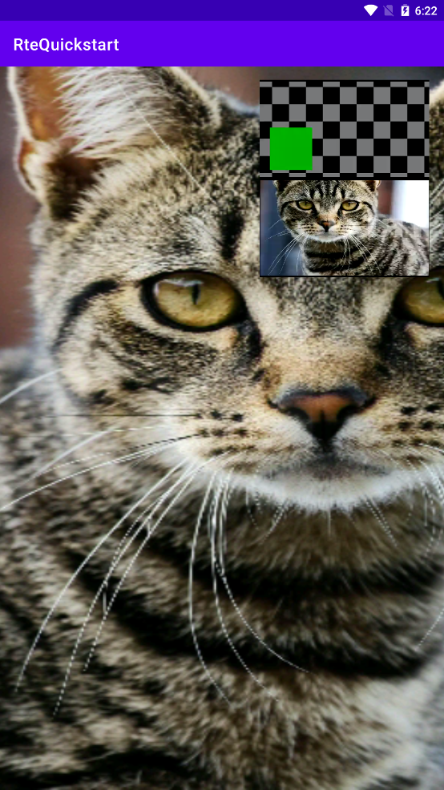

# 五分钟实现摄像头流和屏幕共享流的同时发送


本文介绍如何通过极简代码快速实现摄像头流和屏幕共享流的同时发送。


## 前提条件

你已经根据 [五分钟构建视频通话应用](start_call_android_rte.md) 搭建了一个基础的视频通话应用。

Android 系统版本建议 >= Android 5，且 <= Android 8.1。

## 实现流程

对你已经搭建的应用做以下变更：

https://github.com/AgoraDoc/agora-quickstart-projects/commit/3fabb2b0d713f7645d9b50091e96e77f1c7aba35


### 编译项目并运行 app

将 Android 设备或模拟器连接到你的电脑，并在 Android Studio 里点击 Run 'app'。项目安装到你的设备或模拟器之后，按照以下步骤运行 app：

- 授予你的 app 麦克风和摄像头权限。
- 授予你的 app 屏幕录制权限。
- 启动 app，你会在本地视图中看到自己。
- 在另一台设备或模拟器上运行 app，你可以看到在远端视图看到对端设备采集的视频，包括摄像头视频和屏幕录制视频。



## 常见问题

### Android gradle sync 太慢怎么办？

在 `/Gradle Scripts/build.gradle(Project: RteQuickstart)` 文件中，添加国内镜像源地址。

以阿里云云效 Maven 镜像为例：

```diff
repositories {

...

+    maven {
+      url 'https://maven.aliyun.com/repository/public/'
+    }

...
}
```
