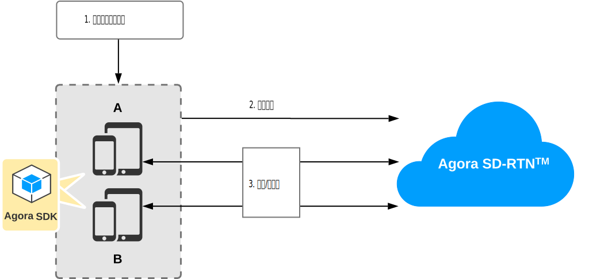
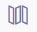
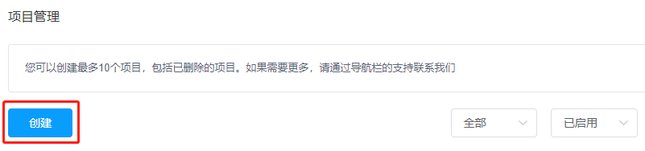
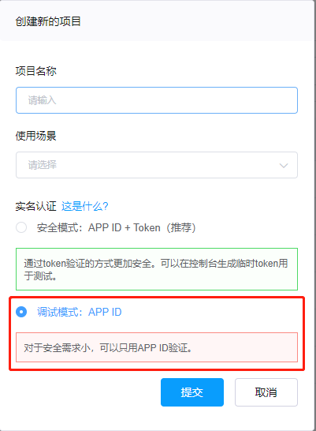
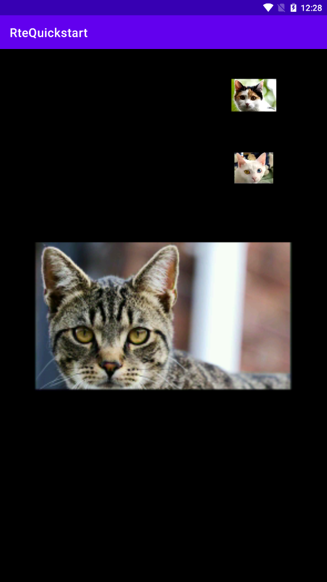

# 五分钟构建视频通话应用

你可以通过在 app 客户端集成 Agora RTE SDK 实现实时音视频互动。

本文介绍如何通过极简代码快速集成 Agora RTE SDK，在你的 Android app 里实现视频通话。

## 技术原理

下图展示在 app 中集成 Agora RTE SDK 实现视频通话的基本工作流程：



主要步骤如下：

1. 创建流。你可以创建一个或多个流。每个流可以最多包含一个视频轨道，但可以包含多个音频轨道。
2. 加入场景。
3. 在场景中发布和订阅流。

## 前提条件

开始前，请确保你的开发环境满足以下条件：

- Android Studio (推荐最新版本)。
- Android SDK API 等级 16 或以上。
- 可以访问互联网的计算机，且网络环境未部署防火墙。
- 运行 Android 4.1 或以上版本的移动设备或模拟器。

## 在客户端构建视频通话应用

本节介绍如何使用 Agora SDK 在客户端构建视频通话应用。

### 创建 Agora 项目

按照以下步骤，在控制台创建一个 Agora 项目。

> 如果你已经创建了 Agora 项目，请确保项目的鉴权机制是 **调试模式：APP ID**。本教程不支持开启**安全模式：开启 App ID + Token** 的 Agora 项目。

1. 登录 Agora [控制台](https://console.agora.io/)，点击左侧导航栏  **项目管理**按钮进入[项目管理](https://dashboard.agora.io/projects)页面。

2. 在**项目管理**页面，点击**创建**按钮。

   [](https://dashboard.agora.io/projects)

3. 在弹出的对话框内输入**项目名称**，选择**鉴权机制**为 **调试模式：APP ID**。Agora 推荐只在测试环境，或对安全要求不高的场景里使用 App ID 鉴权。

   

4. 点击**提交**，新建的项目就会显示在**项目管理**页中。

### 获取 App ID

Agora 会给每个项目自动分配一个 App ID 作为项目唯一标识。

在 [Agora 控制台](https://console.agora.io/)的**项目管理**页面，找到你的项目，点击 App ID 右侧的眼睛图标就可以直接复制项目的 App ID。


### 创建 Android 项目

打开 Android Studio，在 **Welcome to Android Studio** 窗口中，点击 **Create New Project**。依次选择 **Phone and Tablet** > **Empty Activity**，创建 Android 项目。项目参数设置如下：

- **Name**: RteQuickstart
- **Package name**: com.example.rtequickstart
- **Language**: Java
- **Minimum SDK**: API 16: Android 4.1 (Jelly Bean)

创建项目后，Android Studio 会自动开始同步 gradle，请确保同步成功再进行下一步操作。

### 集成 Agora SDK

1. 获取最新版本的 Agora RTE SDK ，并解压。

2. 打开 SDK 包 `sdk` 文件夹，将以下文件或子文件夹复制到你的项目路径中。如果你不需要通过 C++ 接口使用 SDK，则无需 `api` 文件夹。

| 文件或子文件夹           | 项目路径（如果路径不存在请新建）                 |
| ------------------------ | ------------------------ |
| `agora-rte-sdk.jar` 文件 | `/app/libs/`             |
| `arm-v8a` 文件夹         | `/app/src/main/jniLibs/` |
| `armeabi-v7a` 文件夹     | `/app/src/main/jniLibs/` |
| `x86` 文件夹             | `/app/src/main/jniLibs/` |
| `x86_64` 文件夹          | `/app/src/main/jniLibs/` |
| `api` 文件夹（可选）      | `/app/src/main/jniLibs/` |

3. 在 `/Gradle Scripts/build.gradle(Module: RteQuickstart.app)` 文件中， 对本地 Jar 包添加依赖：

    ```gradle
    implementation fileTree(dir: 'libs', include: [ '*.jar' ])
    ```

### 防止代码混淆

在 `/Gradle Scripts/proguard-rules.pro` 文件中添加如下代码，防止混淆 Agora SDK 的代码：

```text
-keep class io.agora.**{*;}
```

### 添加网络及设备权限

在 `/app/Manifests/AndroidManifest.xml` 文件中，在 `</application>` 后面添加如下权限：

```xml
<uses-permission android:name="android.permission.INTERNET"/>
<uses-permission android:name="android.permission.CAMERA"/>
<uses-permission android:name="android.permission.RECORD_AUDIO"/>
<uses-permission android:name="android.permission.MODIFY_AUDIO_SETTINGS"/>
<uses-permission android:name="android.permission.ACCESS_WIFI_STATE"/>
<uses-permission android:name="android.permission.ACCESS_NETWORK_STATE"/>
<uses-permission android:name="android.permission.BLUETOOTH" />
```

### 创建用户界面

用户界面中创建两个布局，分别用于展示本地视频和远端视频。在 `/app/res/layout/activity_main.xml` 文件中，用如下代码进行替换：

```xml
<?xml version="1.0" encoding="UTF-8"?>
<RelativeLayout xmlns:android="http://schemas.android.com/apk/res/android"
    xmlns:tools="http://schemas.android.com/tools"
    android:id="@+id/activity_main"
    android:layout_width="match_parent"
    android:layout_height="match_parent"
    tools:context=".MainActivity">

    <FrameLayout
        android:id="@+id/local_video_view_container"
        android:layout_width="match_parent"
        android:layout_height="match_parent"
        android:background="@android:color/white" />

    <LinearLayout
        android:id="@+id/remote_video_view_container"
        android:layout_width="206dp"
        android:layout_height="360dp"
        android:layout_alignParentTop="true"
        android:layout_alignParentEnd="true"
        android:layout_alignParentRight="true"
        android:layout_marginTop="16dp"
        android:layout_marginEnd="18dp"
        android:layout_marginRight="18dp"
        android:background="#000000"
        android:alpha="0.00"
        android:clipChildren="true"
        android:orientation="vertical" />
</RelativeLayout>
```

### 实现视频通话逻辑

按照以下步骤实现该逻辑：

1. 导入所需的类。

    在 `/app/java/com.example.rtequickstart/MainActivity.java` 文件中，确保你导入以下类：

    ```java
    package com.example.rtequickstart;

    // AndroidX 相关类
    import androidx.core.app.ActivityCompat;
    import androidx.core.content.ContextCompat;
    import androidx.appcompat.app.AppCompatActivity;
    import androidx.core.view.ViewCompat;

    // Android 相关类
    import android.Manifest;
    import android.content.pm.PackageManager;
    import android.util.TypedValue;
    import android.view.SurfaceView;
    import android.view.View;
    import android.view.ViewGroup;
    import android.widget.FrameLayout;
    import android.os.Bundle;
    import android.widget.LinearLayout;

    // Java 原生类
    import java.util.List;
    import java.util.Random;

    // Agora RTE SDK 相关类
    import io.agora.rte.AgoraRteSDK;
    import io.agora.rte.AgoraRteSdkConfig;

    import io.agora.rte.base.AgoraRteLogConfig;

    import io.agora.rte.media.AgoraRteMediaFactory;
    import io.agora.rte.media.camera.AgoraRteCameraCaptureObserver;
    import io.agora.rte.media.camera.AgoraRteCameraSource;
    import io.agora.rte.media.camera.AgoraRteCameraState;
    import io.agora.rte.media.stream.AgoraRtcStreamOptions;
    import io.agora.rte.media.stream.AgoraRteMediaStreamInfo;
    import io.agora.rte.media.track.AgoraRteCameraVideoTrack;
    import io.agora.rte.media.track.AgoraRteMicrophoneAudioTrack;
    import io.agora.rte.media.video.AgoraRteVideoCanvas;
    import io.agora.rte.media.video.AgoraRteVideoSubscribeOptions;

    import io.agora.rte.scene.AgoraRteConnectionChangedReason;
    import io.agora.rte.scene.AgoraRteScene;
    import io.agora.rte.scene.AgoraRteSceneConfig;
    import io.agora.rte.scene.AgoraRteSceneConnState;
    import io.agora.rte.scene.AgoraRteSceneEventHandler;
    import io.agora.rte.scene.AgoraRteSceneJoinOptions;

    import io.agora.rte.user.AgoraRteUserInfo;
    ```

2. 定义全局变量。

    在 `public class MainActivity extends AppCompatActivity {` 后定义以下全局变量。将 `<Your App ID>` 替换为你的 Agora App ID。

    ```java
    // 你的 Agora App ID
    private String appId = "<Your App ID>";
    // 你的 Agora 场景名。本示例设为 "testScene"
    private String sceneId = "testScene";
    // 用户 ID。本示例自动生成随机 user ID
    private String userId = String.valueOf(new Random().nextInt(1024));

    // 你的 Token。在本示例中设为 ""
    private String token = "";

    // 流 ID。本示例自动生成随机流 ID
    private String streamId = String.valueOf(new Random().nextInt(1024));

    // 场景对象
    public AgoraRteScene mScene;
    // 场景事件处理对象
    public AgoraRteSceneEventHandler mAgoraHandler;
    // 摄像头视频轨道对象
    public AgoraRteCameraVideoTrack mLocalVideoTrack;
    // 麦克风音频轨道对象
    public AgoraRteMicrophoneAudioTrack mLocalAudioTrack;
    // 加入场景选项对象
    public AgoraRteSceneJoinOptions options;
    // 媒体工厂对象
    public AgoraRteMediaFactory mMediaFactory;
    ```

3. 定义设备权限处理逻辑。

   在 `onCreate` 方法前面添加设备权限处理逻辑。

   ```java
   // 处理设备权限
   private static final int PERMISSION_REQ_ID = 22;

   private static final String[] REQUESTED_PERMISSIONS = {
           Manifest.permission.RECORD_AUDIO,
           Manifest.permission.CAMERA
   };

   private boolean checkSelfPermission(String permission, int requestCode) {
       if (ContextCompat.checkSelfPermission(this, permission) !=
               PackageManager.PERMISSION_GRANTED) {
           ActivityCompat.requestPermissions(this, REQUESTED_PERMISSIONS, requestCode);
           return false;
       }
       return true;
   }
   ```

4. 定义实现视频通话的基本方法。

    在 `onCreate` 方法后面依次定义以下方法：
    - `initAgoraRteSDK`： 初始化 SDK。

        ```java
        public void initAgoraRteSDK() {
        AgoraRteSdkConfig config = new AgoraRteSdkConfig();
        // 设置 App ID
        config.appId = appId;
        // 设置 context
        config.context = getBaseContext();
        // 设置 log
        config.logConfig = new AgoraRteLogConfig(getBaseContext().getFilesDir().getAbsolutePath());
        /**
         * 初始化 SDK。
         * @param config SDK 配置。
         *
         * @return AgoraRteSDK 对象。
         */
        AgoraRteSDK.init(config);
        }
        ```

    - `registerEventHandler`：初始化 `AgoraRteSceneEventHandler` 对象。你需要在 `AgoraRteSceneEventHandler` 对象的相关回调中实现媒体流的发布与接收逻辑。
        - 媒体流发布：本地用户成功加入场景时（`onConnectionStateChanged` 回调返回 `CONN_STATE_CONNECTED` 时）开始发布媒体流。
        - 媒体流接收：收到远端用户发送的流时（`onRemoteStreamAdded` 被触发时）对远端媒体流进行渲染。

        ```java
        // 初始化 AgoraRteSceneEventHandler 对象
        public void registerEventHandler(){
            // 创建 AgoraRteSceneEventHandler 对象
            mAgoraHandler = new AgoraRteSceneEventHandler() {
                @Override
                public void onConnectionStateChanged(AgoraRteSceneConnState oldState, AgoraRteSceneConnState newState, AgoraRteConnectionChangedReason reason) {
                    super.onConnectionStateChanged(oldState, newState, reason);

                    System.out.println("连接状态已从 " + oldState.toString() + " 变更为 " + newState.toString() + "原因是： " + reason.toString());

                }
                        
                // 远端用户加入场景时触发

                /**
                * 远端用户加入场景时触发。
                * @param users 场景中在线的用户列表。
                */
                @Override
                public void onRemoteUserJoined(List<AgoraRteUserInfo> users) {
                    super.onRemoteUserJoined(users);
                    System.out.println(users.toString());
                }

                // 远端用户离开场景时触发

                /**
                * 远端用户离开场景时触发。
                * @param users 场景中在线的用户列表。
                */
                @Override
                public void onRemoteUserLeft(List<AgoraRteUserInfo> users) {
                    super.onRemoteUserLeft(users);
                    System.out.println(users.toString());
                }

                // 远端用户发流时触发

                /**
                * 远端用户发流时触发。
                * @param streams 场景中的流列表。
                */
                @Override
                public void onRemoteStreamAdded(List<AgoraRteMediaStreamInfo> streams) {
                    super.onRemoteStreamAdded(streams);

                    for (AgoraRteMediaStreamInfo info : streams) {

                        /**
                        * 订阅远端视频。
                        *
                        * @param remoteStreamId 远端流 ID。
                        * @param videoSubscribeOption 订阅选项。
                        */
                        mScene.subscribeRemoteVideo(info.getStreamId(), new AgoraRteVideoSubscribeOptions());
                        /**
                        * 订阅远端音频。
                        *
                        * @param remoteStreamId 远端流 ID。
                        */
                        mScene.subscribeRemoteAudio(info.getStreamId());

                        LinearLayout container = findViewById(R.id.remote_video_view_container);
                        SurfaceView view = new SurfaceView (getBaseContext());

                        view.setZOrderMediaOverlay(true);

                        view.setTag(info.getStreamId());

                        view.setId(ViewCompat.generateViewId());
                        view.setSaveEnabled(true);

                        ViewGroup.LayoutParams layoutParams = new LinearLayout.LayoutParams(LinearLayout.LayoutParams.MATCH_PARENT, (int) TypedValue.applyDimension(TypedValue.COMPLEX_UNIT_DIP, 120, getResources().getDisplayMetrics()));
                        container.addView(view, -1, layoutParams);

                        AgoraRteVideoCanvas canvas = new AgoraRteVideoCanvas(view);
                        /**
                        * public static final int RENDER_MODE_HIDDEN = 1;
                        * public static final int RENDER_MODE_FIT = 2;
                        * public static final int RENDER_MODE_ADAPTIVE = 3;
                        */
                        canvas.renderMode = 2;
                        /**
                        * 设置远端视频渲染画布。
                        * @param remoteStreamId 远端流的 ID。
                        * @param canvas AgoraVideoCanvas 对象。
                        *
                        * @return
                        * 0：方法调用成功。
                        * <0：方法调用失败。
                        */
                        mScene.setRemoteVideoCanvas(info.getStreamId(), canvas);

                    }

                }

                // 远端用户停止发流时触发
                /**
                * 远端用户停止发流时触发。
                * @param streams scene 中的流列表。
                */
                @Override
                public void onRemoteStreamRemoved(List<AgoraRteMediaStreamInfo> streams) {
                    super.onRemoteStreamRemoved(streams);

                    for (AgoraRteMediaStreamInfo info : streams) {

                        LinearLayout container = findViewById(R.id.remote_video_view_container);
                        View view = container.findViewWithTag(info.getStreamId());
                        container.removeView(view);

                        /**
                        * 取消订阅视频。
                        *
                        * @param remoteStreamId 远端流的 ID。
                        */
                        mScene.unsubscribeRemoteVideo(info.getStreamId());
                        /**
                        * 取消订阅音频。
                        *
                        * @param remoteStreamId 远端流的 ID。
                        */
                        mScene.unsubscribeRemoteAudio(info.getStreamId());

                    }

                }
            };
        }
        ```

    - `createAndJoinScene`：创建并加入场景。只有加入相同场景的用户才可以互相发送和订阅媒体流。

        ```java
        public void createAndJoinScene(String sceneId, String userId, String token) {
        // 创建场景
        AgoraRteSceneConfig sceneConfig = new AgoraRteSceneConfig();
        /**
         * 创建场景
         * @param sceneId 用于标识场景的 ID。
         * @param sceneConfig 场景配置。
         *
         * @return AgoraRteScene 对象。
         */
        mScene = AgoraRteSDK.createRteScene(sceneId, sceneConfig);

        // 注册 scene event handler
        mScene.registerSceneEventHandler(mAgoraHandler);

        options = new AgoraRteSceneJoinOptions();
        options.setUserVisibleToRemote(true);

        /**
         * 加入场景
         * @param userId 用于标识用户的 ID。在一个场景中必须唯一。
         * @param token 用于鉴权的 Token。
         * @param options 加入场景选项。
         *
         * @return
         * 0：方法调用成功。
         * <0：方法调用失败。
         */
        mScene.join(userId, token, options);
        }

    - `createAndPublishStream`：创建并发布流。

        ```java
        public void createAndPublishStream(String streamId){
            // 创建实时音视频流
            AgoraRtcStreamOptions streamOption = new AgoraRtcStreamOptions();
            /**
            * 创建或更新 RTC 流。
            * @param streamId 用于标识流的 ID。在一个场景中必须唯一。
            * @param streamOption 发流选项。
            *
            * @return
            * 0：方法调用成功。
            * <0：方法调用失败。
            *
            */
            mScene.createOrUpdateRTCStream(streamId, streamOption);

            FrameLayout container = findViewById(R.id.local_video_view_container);

            mMediaFactory = AgoraRteSDK.getRteMediaFactory();

            // 创建摄像头视频轨道
            /**
            * 创建摄像头采集视频轨道
            *
            * @return AgoraRteCameraVideoTrack 对象。
            */
            mLocalVideoTrack = mMediaFactory.createCameraVideoTrack();

            // 必须先调用 setPreviewCanvas 设置预览画布，再调用 startCapture 开始摄像头采集视频
            SurfaceView view = new SurfaceView(getBaseContext());
            container.addView(view);

            AgoraRteVideoCanvas canvas = new AgoraRteVideoCanvas(view);
            if (mLocalVideoTrack != null) {
                // 设置本地预览的 Canvas
                /**
                * 设置预览画布。
                * @param canvas AgoraRteVideoCanvas 对象。
                *
                * @return
                * 0：方法调用成功。
                * <0：方法调用失败。
                */
                mLocalVideoTrack.setPreviewCanvas(canvas);

                AgoraRteCameraCaptureObserver cameraCaptureObserver = new AgoraRteCameraCaptureObserver() {
                    /**
                    * 摄像头状态变更时触发。
                    * @param agoraRteCameraState 摄像头状态。
                    * @param agoraRteCameraSource 摄像头源。
                    */
                    @Override
                    public void onCameraStateChanged(AgoraRteCameraState agoraRteCameraState, AgoraRteCameraSource agoraRteCameraSource) {
                        System.out.println("Camera state: " + agoraRteCameraState.toString() + " Camera source: " + agoraRteCameraSource.toString());
                    }
                };

                // 开始摄像头采集视频
                /**
                * 开始摄像头采集。
                * @param agoraRteCameraCaptureObserver 摄像头状态监听器。
                *
                * @return
                * 0：方法调用成功。
                * <0：方法调用失败。
                */
                mLocalVideoTrack.startCapture(cameraCaptureObserver);
            }
            // 发布本地视频轨道
            /**
            * 将本地视频轨道发布到指定流。
            *
            * 一个流最多可包含一个视频轨道。
            *
            * @param streamId 本地流的 ID。
            * @param videoTrack 要发布的视频轨道。
            *
            * @return
            * 0：方法调用成功。
            * <0：方法调用失败。
            */
            mScene.publishLocalVideoTrack(streamId, mLocalVideoTrack);
            // 创建麦克风音频轨道

            mLocalAudioTrack = mMediaFactory.createMicrophoneAudioTrack();
            // 开始麦克风采集音频
            /**
            * 开始录制音频。
            *
            * @return
            * 0：方法调用成功。
            * <0：方法调用失败。
            *
            */
            mLocalAudioTrack.startRecording();
            // 发布本地音频轨道
            /**
            * 将本地音频轨道发布到指定流。
            *
            * 一个流可包含多个音频轨道。
            *
            * @param streamId 本地流的 ID。
            * @param audioTrack 要发布的视频轨道。
            *
            * @return
            * 0：方法调用成功。
            * <0：方法调用失败。
            */
            mScene.publishLocalAudioTrack(streamId, mLocalAudioTrack);
        }
        
        ```

4. 在 `onCreate` 回调中按顺序调用定义的基本方法。

    ```java
    @Override
    protected void onCreate(Bundle savedInstanceState) {
        super.onCreate(savedInstanceState);
        setContentView(R.layout.activity_main);
        // 1. 初始化 SDK
        initAgoraRteSDK();
        // 2. 初始化 AgoraRteSceneEventHandler 对象
        registerEventHandler();
        // 3. 申请设备权限。权限申请成功后，创建并加入场景, 监听远端媒体流并发送本地媒体流
        if (checkSelfPermission(REQUESTED_PERMISSIONS[0], PERMISSION_REQ_ID) &&
                checkSelfPermission(REQUESTED_PERMISSIONS[1], PERMISSION_REQ_ID)) {
            createAndJoinScene(sceneId, userId, token);
            createAndPublishStream(streamId);
        }

    }
    ```

5. 在 `onCreate` 回调后定义 `onDestroy` 回调。在 `onDestroy` 回调中离开场景并销毁 AgoraRteSDK 对象。

    ```java
    protected void onDestroy() {
        super.onDestroy();

        // 1. 离开场景
        /**
         * 离开场景。
         */
        mScene.leave();
        // 2. 销毁 AgoraRteSDK 对象
        /**
         * 销毁 AgoraRteSDK 对象。
         *
         * @return
         * 0：方法调用成功。
         * <0：方法调用失败。
         */
        AgoraRteSDK.deInit();
    }
    ```

### 编译项目并运行 app

将 Android 设备或模拟器连接到你的电脑，并在 Android Studio 里点击 Run 'app'。项目安装到你的设备或模拟器之后，按照以下步骤运行 app：

- 授予你的 app 麦克风和摄像头权限。
- 启动 app，你会在本地视图中看到自己。
- 在另一台设备或模拟器上运行 app，你可以看到在远端视图看到对端设备采集的视频。



## 常见问题

### Android gradle sync 太慢怎么办？

在 `/Gradle Scripts/build.gradle(Project: RteQuickstart)` 文件中，添加国内镜像源地址。

以阿里云云效 Maven 镜像为例：

```diff
repositories {

...

+    maven {
+      url 'https://maven.aliyun.com/repository/public/'
+    }

...
}
```
