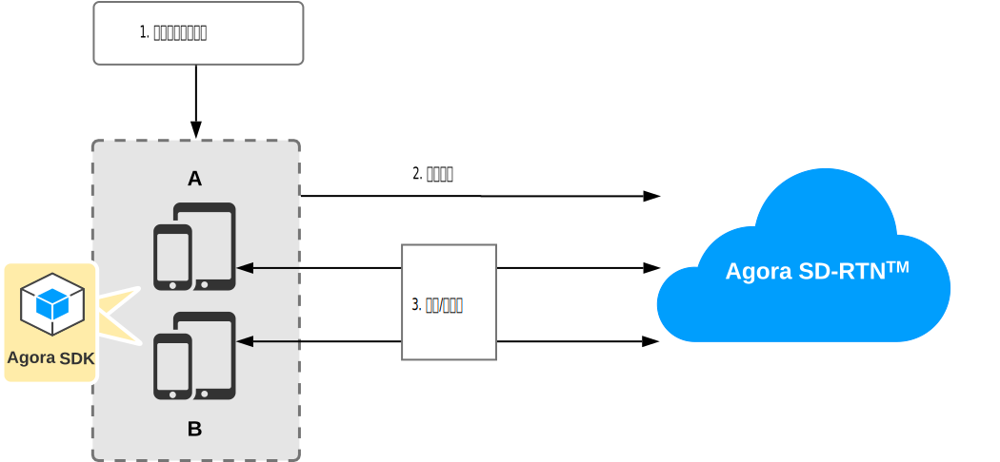
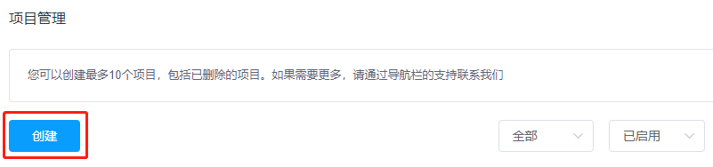
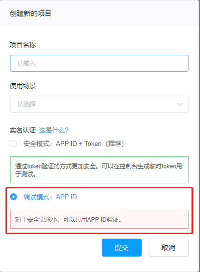

# 五分钟构建视频通话应用

你可以通过在 app 客户端集成 Agora RTE SDK 实现实时音视频互动。

本文介绍如何通过极简代码快速集成 Agora RTE SDK，在你的 iOS app 里实现视频通话。

## 技术原理

下图展示在 app 中集成 Agora RTE SDK 实现视频通话的基本工作流程：



主要步骤如下：

1. 创建流。你可以创建一个或多个流。每个流可以最多包含一个视频轨道，但可以包含多个音频轨道。
2. 加入场景。
3. 在场景中发布和订阅流。

## 前提条件

开始前，请确保你的开发环境满足以下条件：

- Xcode (推荐最新版本)。
- 可以访问互联网的 macOS 设备，且网络环境未部署防火墙。
- 运行 iOS 8.0 或以上版本操作系统的 Apple 设备。

## 在客户端构建视频通话应用

本节介绍如何使用 Agora SDK 在客户端构建视频通话应用。

### 创建 Agora 项目

按照以下步骤，在控制台创建一个 Agora 项目。

> 如果你已经创建了 Agora 项目，请确保项目的鉴权机制是 **调试模式：APP ID**。本教程不支持开启**安全模式：开启 App ID + Token** 的 Agora 项目。

1. 登录 Agora [控制台](https://console.agora.io/)，点击左侧导航栏  **项目管理**按钮进入[项目管理](https://dashboard.agora.io/projects)页面。

2. 在**项目管理**页面，点击**创建**按钮。

   [](https://dashboard.agora.io/projects)

3. 在弹出的对话框内输入**项目名称**，选择**鉴权机制**为 **调试模式：APP ID**。Agora 推荐只在测试环境，或对安全要求不高的场景里使用 App ID 鉴权。

   

4. 点击**提交**，新建的项目就会显示在**项目管理**页中。

### 获取 App ID

Agora 会给每个项目自动分配一个 App ID 作为项目唯一标识。

在 [Agora 控制台](https://console.agora.io/)的**项目管理**页面，找到你的项目，点击 App ID 右侧的眼睛图标就可以直接复制项目的 App ID。


### 创建 iOS 项目

1. 打开 Xcode 并点击 **Create a new Xcode project**。

2. 选择平台类型为 iOS、项目类型为 Single View App，并点击 **Next**。

3. 输入以下项目信息，并点击 **Next**。

   - **Product Name**: RteQuickstart
   - **Team**: 选择你的 Apple ID 或其他 team 账户
   - **Organization Name**: io.agora
   - **Language**: Swift
   - **User Interface**: Storyboard

4. 选择项目存储路径，并点击 **Create**。

### 集成 Agora SDK

1. 将 `libs` 文件夹中的动态库复制到项目的 `./project_name` 文件夹下（`project_name` 为你的项目名称）。

2. 打开 Xcode，进入 **TARGETS > Project Name > General > Frameworks, Libraries, and Embedded Content** 菜单。

3. 点击 **+ > Add Other… > Add Files** 添加对应动态库，并确保添加的动态库 **Embed** 属性设置为 **Embed & Sign**。
   添加完成后，项目会自动链接所需系统库。

> 根据 Apple 官方要求，app 的 Extension 中不允许包含动态库。如果项目中的 Extension 需要集成 SDK，则添加动态库时需将文件状态改为 Do Not Embed。

### 添加设备权限

在 Xcode 中，打开 `info.plist` 文件。在右侧列表中添加如下内容，获取相应的设备权限：

| Key                                    | Type   | Value                                      |
| -------------------------------------- | ------ | ------------------------------------------ |
| Privacy - Microphone Usage Description | String | 使用麦克风的目的，例如：for a video call。 |
| Privacy - Camera Usage Description     | String | 使用摄像头的目的，例如：for a video call。 |

### 实现视频通话逻辑

按照以下步骤实现该逻辑：

1. 导入所需的类。

   在 `ViewController.swift` 文件中，确保你导入以下类：

   ```swift
   import UIKit
   import AgoraRTE
   ```

2. 定义全局变量。

   在 `class ViewController: UIViewController {` 后定义以下全局变量。将 `<Your App ID>` 替换为你的 Agora App ID。

    ```swift
    // 定义全局变量
    // 用于渲染本地视频的 UIView 对象
    var localView: UIView!
    // 用于渲染远端视频的 UIView 对象
    var remoteStackView: UIStackView!
    // SDK 对象
    var agoraRteSdk: AgoraRteSdk!

    // 场景对象
    var scene: AgoraRteSceneProtocol!
    // 麦克风音频轨道对象
    var microphoneTrack: AgoraRteMicrophoneAudioTrackProtocol!
    // 摄像头视频轨道对象
    var cameraTrack: AgoraRteCameraVideoTrackProtocol!
    // 本地流 ID。本示例自动生成随机流 ID
    let localStreamId = String(UInt.random(in: 1000...2000))
    // 本地用户 ID。本示例自动生成随机用户 ID
    let localUserId = String(UInt.random(in: 1000...2000))
    // 场景 ID
    let sceneId = "testScene"
    // 你的 Agora App ID
    let appId = "<Your App ID>"
    ```

3. 定义实现视频通话的基本方法。

   在 `viewDidLoad` 方法后面依次定义以下方法：

   - `initSdk`： 初始化 SDK 和 View。

    ```swift
    func initSdk(){
        // 初始化 AgoraRteSdk 对象
        let profile = AgoraRteSdkProfile()
        profile.appid = appId
        /**
        * 初始化 SDK。
        * @param profile SDK 配置。
        *
        * @return AgoraRteSdk 对象。
        */
        agoraRteSdk = AgoraRteSdk.sharedEngine(with: profile)

        localView = UIView()
        localView.frame = self.view.bounds

        remoteStackView = UIStackView()
        remoteStackView.frame = CGRect(x: self.view.bounds.width - 180, y: 0, width: 180, height: 360)
        remoteStackView.axis = .vertical
        remoteStackView.distribution = .fillEqually
        self.view.addSubview(remoteStackView)

    }
    ```

   - `createAndJoinScene`：创建并加入场景。只有加入相同场景的用户才可以互相发送和订阅媒体流。

    ```swift
    func createAndJoinScene(){
        // 创建场景
        let config = AgoraRteSceneConfig()
        scene = agoraRteSdk.createRteScene(withSceneId: sceneId, sceneConfig: config)

        // 设置场景事件 delegate
        scene?.setSceneDelegate(self)

        // 创建并添加本地 view

        self.view.addSubview(localView)

        // 加入场景
        let options = AgoraRteJoinOptions()
        scene.joinScene(withUserId: localUserId, token: "", joinOptions: options)
    }
    ```

4. 在 `viewDidLoad` 回调中按顺序调用定义的基本方法。

    ```swift
    override func viewDidLoad() {
            super.viewDidLoad()
            // Do any additional setup after loading the view.
            // 1. 初始化 SDK
            initSdk()
            // 2. 加入场景，开始发流
            createAndJoinScene()
        }
    ```

5. 在 `viewDidLoad` 回调后定义 `viewDidDisappear` 回调。在 `viewDidDisappear` 回调中离开场景并销毁 AgoraRteSDK 对象。

    ```swift
    override func viewDidDisappear(_ animated: Bool) {
            super.viewDidDisappear(animated)
            // 离开场景
            scene?.leave()
            // 销毁 SDK 对象
            AgoraRteSdk.destroy()
        }
    ```

6. 在 `class ViewController: UIViewController` 之外新建一个 extension，用于实现场景事件回调逻辑。

    ```swift
    extension ViewController: AgoraRteSceneDelegate {

    // 当连接状态为 connected 时，开始发流
    func agoraRteScene(_ rteScene: AgoraRteSceneProtocol, connectionStateDidChangeFromOldState oldState: AgoraConnectionState, toNewState state: AgoraConnectionState, with reason: AgoraConnectionChangedReason) {

        print("Connection state has changed to:\(state.rawValue) reason:\(reason.rawValue)")

        if state == AgoraConnectionState.connected {
            let mediaFactory = agoraRteSdk.rteMediaFactory()
            // 创建摄像头视频轨道
            /**
            * 创建摄像头采集视频轨道
            *
            * @return AgoraRteCameraVideoTrack 对象。
            */
            cameraTrack = mediaFactory?.createCameraVideoTrack()

            let videoCanvas = AgoraRtcVideoCanvas()
            videoCanvas.userId = localUserId
            videoCanvas.view = localView
            videoCanvas.renderMode = .hidden

            // 必须先调用 setPreviewCanvas 设置预览画布，再调用 startCapture 开始摄像头采集视频
            // 设置预览画布
            /**
            * 设置预览画布。
            * @param canvas AgoraRteVideoCanvas 对象。
            *
            * @return
            * 0：方法调用成功。
            * <0：方法调用失败。
            */
            cameraTrack?.setPreviewCanvas(videoCanvas)

            // 摄像头开始捕获视频
            /**
            * 开始摄像头采集。
            *
            * @return
            * 0：方法调用成功。
            * <0：方法调用失败。
            */
            cameraTrack?.startCapture()

            // 创建麦克风音频轨道
            microphoneTrack = mediaFactory?.createMicrophoneAudioTrack()
            // 麦克风开始录制音频
            microphoneTrack?.startRecording()

            let streamOption = AgoraRteRtcStreamOptions()
            streamOption.token = ""

            /**
            * 创建或更新 RTC 流。
            * @param localStreamId 用于标识流的 ID。在一个场景中必须唯一。
            * @param streamOption 发流选项。
            *
            * @return
            * 0：方法调用成功。
            * <0：方法调用失败。
            *
            */
            scene?.createOrUpdateRTCStream(localStreamId, rtcStreamOptions: streamOption)

            // 发布本地音频轨道
            /**
            * 将本地音频轨道发布到指定流。
            *
            * 一个流可包含多个音频轨道。
            *
            * @param localStreamId 本地流的 ID。
            * @param rteAudioTrack 要发布的视频轨道。
            *
            * @return
            * 0：方法调用成功。
            * <0：方法调用失败。
            */
            scene?.publishLocalAudioTrack(localStreamId, rteAudioTrack: microphoneTrack!)

            // 发布本地视频轨道
            /**
            * 将本地视频轨道发布到指定流。
            *
            * 一个流最多可包含一个视频轨道。
            *
            * @param localStreamId 本地流的 ID。
            * @param rteVideoTrack 要发布的视频轨道。
            *
            * @return
            * 0：方法调用成功。
            * <0：方法调用失败。
            */
            scene?.publishLocalVideoTrack(localStreamId, rteVideoTrack: cameraTrack!)
        }
    }

    // 远端发流时，订阅流并创建相应的 UIView 在本地进行渲染
    func agoraRteScene(_ rteScene: AgoraRteSceneProtocol, remoteStreamesDidAddWith streamInfos: [AgoraRteStreamInfo]?) {
        guard let infos = streamInfos else { return }
        for info in infos {

            rteScene.subscribeRemoteAudio(info.streamId!)
            let option = AgoraRteVideoSubscribeOptions()
            /**
            * 订阅远端视频。
            *
            * @param remoteStreamId 远端流 ID。
            * @param videoSubscribeOptions 订阅选项。
            */
            rteScene.subscribeRemoteVideo(info.streamId!, videoSubscribeOptions: option)

            DispatchQueue.main.async { [weak self] in
                guard let strongSelf = self else {
                    return
                }

                let remoteView = UIView()
                remoteView.tag = Int(info.streamId!)!
                strongSelf.remoteStackView.addArrangedSubview(remoteView)

                let videoCanvas = AgoraRtcVideoCanvas()
                // videoCanvas.userId = info.userId!
                videoCanvas.view = remoteView
                videoCanvas.renderMode = .fit
                /**
                * 设置远端视频渲染画布。
                * @param remoteStreamId 远端流的 ID。
                * @param videoCanvas AgoraVideoCanvas 对象。
                *
                * @return
                * 0：方法调用成功。
                * <0：方法调用失败。
                */
                rteScene.setRemoteVideoCanvas(info.streamId!, videoCanvas: videoCanvas)
            }
        }
    }

    // 远端停止发流时，停止订阅流并删除相关的 UIView
    func agoraRteScene(_ rteScene: AgoraRteSceneProtocol, remoteStreamDidRemoveWith streamInfos: [AgoraRteStreamInfo]?) {
        guard let infos = streamInfos else { return }
        for info in infos {
            /**
            * 取消订阅视频。
            *
            * @param remoteStreamId 远端流的 ID。
            */
            rteScene.unsubscribeRemoteAudio(info.streamId!)

            /**
            * 取消订阅音频。
            *
            * @param remoteStreamId 远端流的 ID。
            */
            rteScene.unsubscribeRemoteAudio(info.streamId!)

            let viewToRemove = self.remoteStackView.viewWithTag(Int(info.streamId!)!)!
            self.remoteStackView.removeArrangedSubview(viewToRemove)
            }
        }

    }
    ```

### 编译项目并运行 app

将 iOS 设备连接到你的电脑，并在 Xcode 里点击 Run 'app'。项目安装到你的设备之后，按照以下步骤运行 app：

- 授予你的 app 麦克风和摄像头权限。
- 启动 app，你会在本地视图中看到自己。
- 在另一台设备或模拟器上运行 app，你可以看到在远端视图看到对端设备采集的视频。


